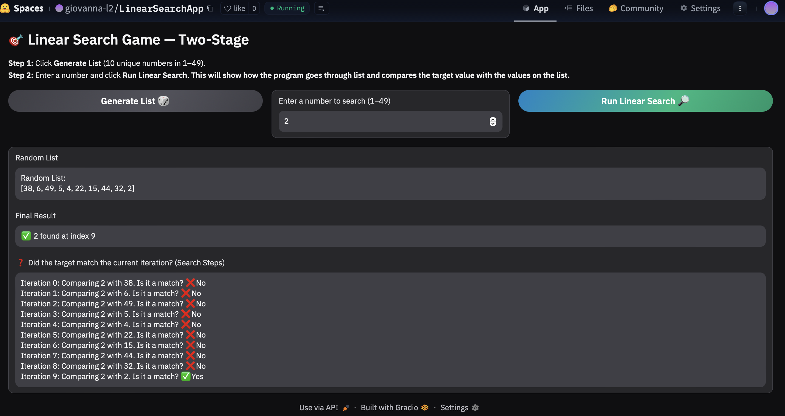
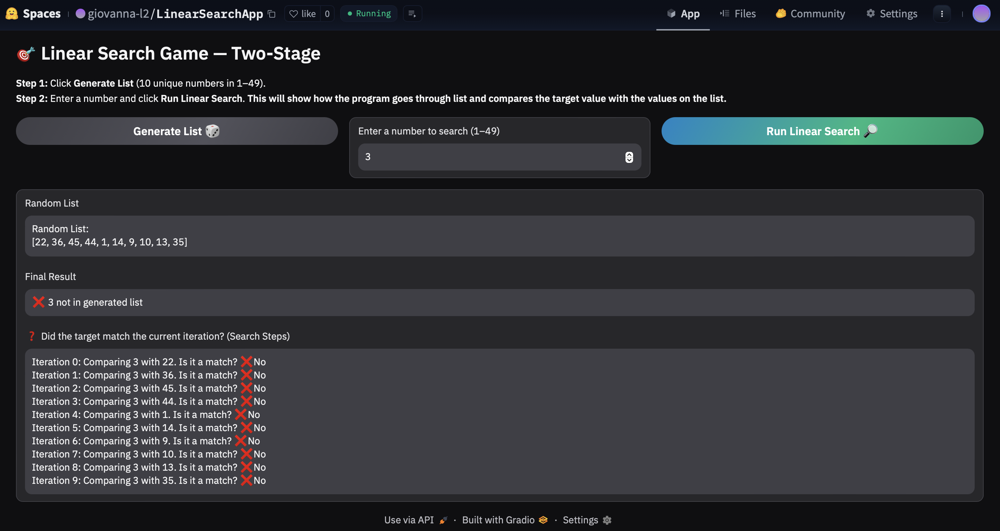
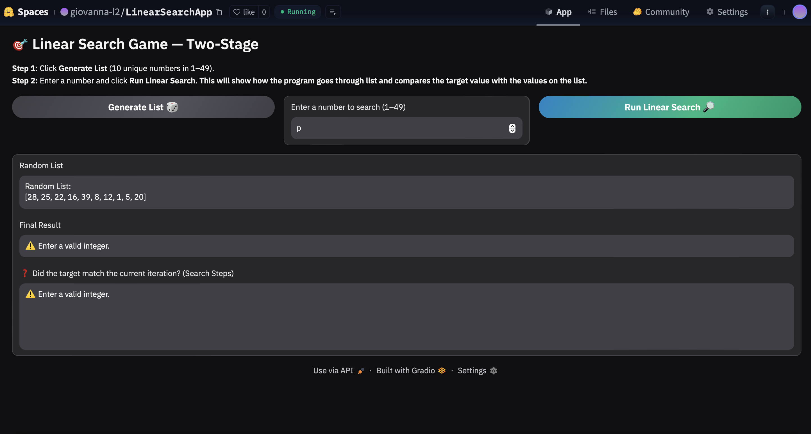

# LinearSearch

##Linear Search App

##Demo video/gif/screenshot of test

##Problem Breakdown & Computational Thinking-  This program creates a random list with 10 distinct numbers then displays these numbers to the user. 
the list is then stored so it can be used for the search. The user is then asked to input a number they wish to search for and press begin search. The linear search is then performed
It compares each element in the list with the target value and stops if it is found. Each comparison is also displayed. It shows a step-by-step demonstration about how linear search works.
Linear search has a repeated algorithm behaviour and performs a comparison for each number in the list. The linear search is simplified so it is easier for the user to understand how it works. The user doesn’t see the python loops and the errors and edge cases are converted to simple messages.
These detais allow the user to focus on understading the concept of linear search rather than the technicalities. 

##Steps to run- The general algorithm design requires the user to click generate list, choose a number to search for, and click linear search. The process includes identifying if the input is valid and then it loops through the list searching for the input. 
If the search finds the target it stops and stores the index, if it doesn’t find it, it returns not found. The output is then the final message of found or not found and the index of the value if it is found. In addition, it also shows the list of all the comparison steps. 

##Hugging Face Link- https://huggingface.co/spaces/giovanna-l2/LinearSearchApp/tree/main

##Author & Acknowledgment- I made this app, using several tools including ChatGPT, other AI tools such as Gemini as well as the helpful video from class and other people's code 

